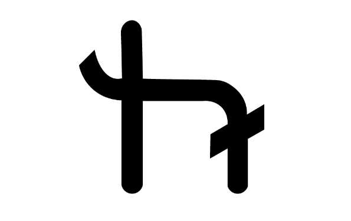

# Halo Platform Glo Documentation

The following is documentation built for the Halo Platform blockchain network. 

## FAQ

Our general Halo Platform FAQ is hosted [at our wiki](https://wiki.haloplatform.tech/FAQ)

## Guides :100:

- [What is Glo & Halo Platform?](guides/what-is-glo-halo-platform.md)
- [Quick Commands](guides/quick-commands.md)
- [Compile Glo from Source](guides/compile-glo-from-source.md)
- [Sending Private Transactions](guides/send-private-transaction.md)
- [Feather Client Integration](guides/feather-client-integration.md)
- [Mining](guides/mining.md)

*Running Nodes*

- [Simply Running A Node](guides/running-a-node.md)
- [Types of nodes](guides/types-of-nodes.md)
- [Running a light node on testnet](guides/run-light-node-testnet.md)
- [Running a Masternodes on AWS](guides/masternodes-on-aws.md)
- [Running a Full Node as Light Node Server](guides/full-lightserver.md)
- [Start a private network for local development](guides/start-private-network.md)

## API

General guides against API level and technology used in blockchain.

- [private send](api/private-send.md)
- [privacy info](api/privacy.md)

## Closing Remarks

Docs maintained by [shadowcodex](https://github.com/shadowcodex)

[Licenses, Acknowledgements, and References](acknowledges.md)