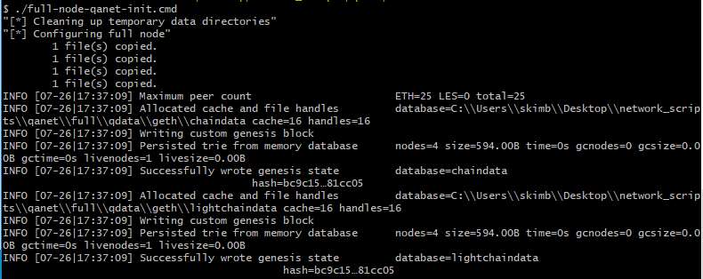
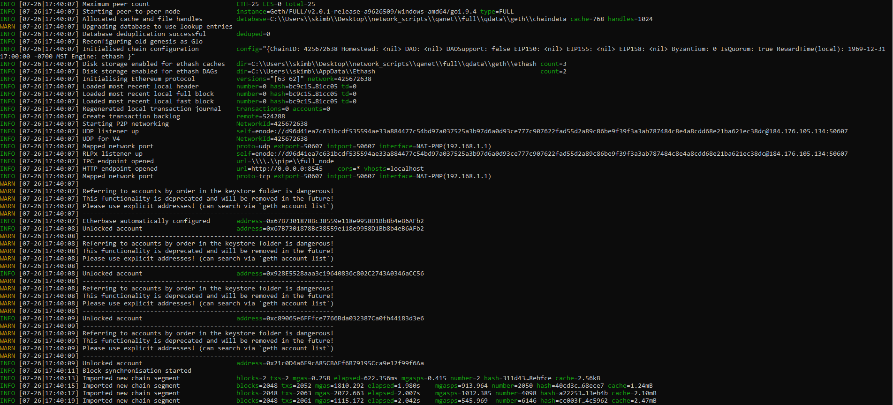

The following guide will help you in setting up a local `glo` node and connect to any of the Halo networks (testnet, devnet, qanet, mainnet)
1. First thing will be to download glo for your OS and can be found at https://haloplatform.tech/downloads
2. Once that is downloaded you can either add it to your `PATH` for ease of use from your cli or you can always navigate to where it is stored and reference locally
3. Next clone this repo: https://github.com/haloplatform/go-halo-scripts.git
    1. This repo contains helpful scripts for connecting your glo node to any Halo network with 2 cli commands
4. For our purposes we will connect to `qanet` but understand that the process is the same for any other Halo network
    1. Please navigate to `go-halo-scripts/qanet/full` from your cli (Usually done with `cd go-halo-scripts/qanet/full`)
    2. If you are on Windows run `./full-node-qanet-init.cmd` or on Linux/Mac run `./full-node-qanet-init.sh`
    
    3. Next if you are on Windows run `./full-node-qanet-start.cmd` or on Linux/Mac run `./full-node-qanet-start.sh`
    
5. Once you see the logs pring `Blockchain Synchronization Started` and some blocks coming in you are done!

**Note**
If you wish to connect `Feather` to a locally running `glo` node you will need to alter the `full-node-{network}-start` script as follows:
1. Change `--rpcport 9565` to `--rpcport 8545`
2. Add `--rpccorsdomain "*"` after `--rpcport 8545`